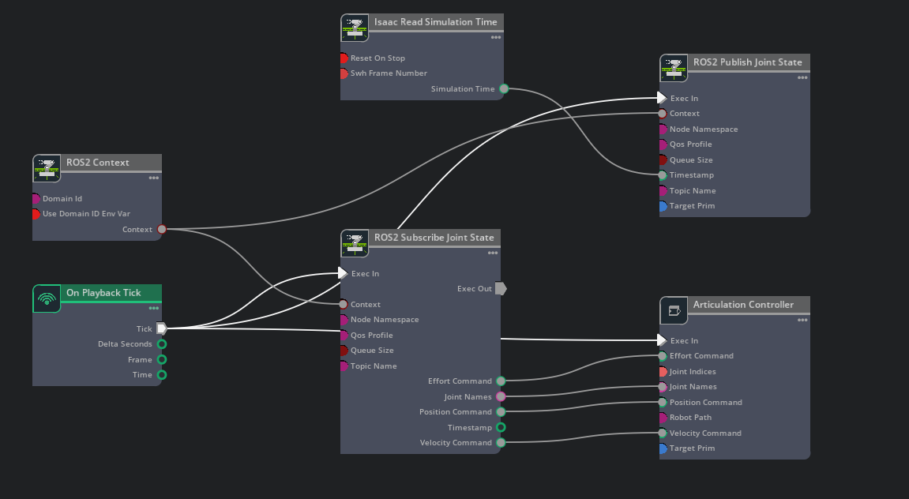

# hex_ros_isaacsim_arm
**English** | [中文](README_CN.md)

## Table of Contents

- [1. Package Overview](#1-package-overview)
- [2. Package Structure](#2-package-structure)
- [3. Topic Interface](#3-topic-interface)
- [4. Control Modes](#4-control-modes)
- [5. Parameters](#5-parameters)
- [6. Dependencies](#6-dependencies)
- [7. Isaac Sim Action Graph](#7-isaac-sim-action-graph)
- [8. Quick Start](#8-quick-start)
- [9. Common Issues](#9-common-issues)

---

## 1. Package Overview

`hex_ros_isaacsim_arm` is a ROS 2 Bridge forwarding package for the Isaac Sim Archer Y6 manipulator.

This package:

- subscribes to upstream arm and gripper `manip_ctrl` commands;
- subscribes to joint states published by the Isaac Sim Bridge;
- forwards supported commands as `sensor_msgs/msg/JointState` messages for Isaac Sim;
- uses parameters to select the Bridge state and command topics.

The package provides the Archer Y6 node and supports the following gripper configurations:

- `empty`: no gripper;
- `gp80`: GP80 gripper;
- `gr100`: GR100 gripper.

This package does not connect to a real robot controller and does not publish the `manip_state` topic used by the real robot driver package.

---

## 2. Package Structure

```text
hex_ros_isaacsim_arm/
├── config/ros2/
│   └── archer_params.yaml
├── launch/ros2/
│   └── isaacsim_archer_y6.launch.py
├── hex_ros_isaacsim_arm/
│   ├── isaacsim_archer_y6.py
│   └── utility/
├── package.xml
├── setup.py
└── README_CN.md
```

### Node Entry Point

| Node | Executable | Description |
|---|---|---|
| Archer Y6 | `isaacsim_archer_y6` | Forwards Archer arm and gripper control commands |

---

## 3. Topic Interface

| Direction | Topic/Parameter | Default Topic | Type | Description |
|---|---|---|---|---|
| Subscribe | `manip_ctrl` | `manip_ctrl` | `hex_ros_msgs/msg/HexRosRoboManipCtrlStamped` | Arm and gripper control input |
| Subscribe | `joint_state_topic` | `/joint_states` | `sensor_msgs/msg/JointState` | Isaac Sim Bridge joint state |
| Publish | `joint_command_topic` | `/joint_command` | `sensor_msgs/msg/JointState` | Isaac Sim Bridge joint command |

Both `joint_state_topic` and `joint_command_topic` can be customized in `config/ros2/archer_params.yaml`. The Isaac Sim Bridge state publisher and command subscriber must use the corresponding topic names.

### `JointState` Fields

For `/joint_command`:

- `name`: joint names and their array order;
- `position`: joint position targets;
- `effort`: joint torque or feed-forward torque values.

---

## 4. Control Modes

### Arm

| Mode | Status | Description |
|---|---|---|
| `JNT` | Supported | Joint position control |
| `EE` | Supported | End-effector pose control |
| `MIT` | Unsupported | Logs a warning and does not publish the command |

### Gripper

| Mode | Status | Description |
|---|---|---|
| `NONE` | Supported | Empty mode; clears the currently retained command |
| `JNT` | Supported | Joint position control |
| `TAU` | Supported | Torque control with a maximum absolute torque of `40 N·m` |
| `MIT` | Unsupported | Logs a warning and does not publish the command |

`NONE` is an empty mode. It does not send an additional position or torque target. Unsupported MIT commands are not converted to another control mode.

---

## 5. Parameters

Parameter file: `config/ros2/archer_params.yaml`

| Parameter | Default | Description |
|---|---|---|
| `ctrl_rate` | `1000.0` | Control command forwarding rate [Hz] |
| `use_sim_time` | `true` | Whether to use ROS simulation time |
| `robot_grip_type` | `gr100` | Gripper type: `empty`, `gp80`, or `gr100` |
| `urdf_path` | `""` | Archer URDF path used by EE control |
| `joint_state_topic` | `/joint_states` | Customizable Bridge state topic |
| `joint_command_topic` | `/joint_command` | Customizable Bridge command topic |

The launch file overrides `urdf_path` with the `empty.urdf` resource from `hex_ros_urdf_archer_y6`. If the node is run directly or this parameter is overridden, provide a valid URDF path to use EE control.

> When `use_sim_time` is `true`, Isaac Sim must publish the `/clock` topic.

---

## 6. Dependencies

### Python Packages

This package uses the ROS 2 Python environment and the following Python dependencies:

```shell
pip3 install 'numpy>=1.17.4'
pip3 install 'hex-util-msg>=0.1.0a4'
pip3 install 'hex-util-ros>=0.0.1a6'
```

This package uses Python 3.10 in a ROS 2 Humble environment. `hex-util-msg` and `hex-util-ros` require Python 3.8 or newer.

### ROS Packages

Create a ROS 2 workspace and clone the message, URDF, and package repositories:

```shell
mkdir -p <your_ws>/src
cd <your_ws>/src
git clone https://github.com/hexfellow/hex_ros_msgs.git
git clone https://github.com/hexfellow/hex_ros_urdf_archer_y6.git
git clone https://github.com/hexfellow/hex_ros_isaacsim_arm.git
```

### Isaac Sim ROS 2 Bridge

The Isaac Sim side must enable the ROS 2 Bridge and provide `JointState` state publishing and command subscription interfaces that match this package's parameters. Refer to the official documentation:

- [Isaac Sim ROS 2 Installation](https://docs.isaacsim.omniverse.nvidia.com/latest/installation/install_ros.html)

The ROS 2 node and Isaac Sim Bridge must use compatible communication settings:

- `ROS_DOMAIN_ID` should be the same;
- `RMW_IMPLEMENTATION` should be the same or compatible;
- DDS discovery must be able to reach both endpoints;
- Docker containers must use a network that permits communication;
- communication must not be restricted to each container's localhost interface.

### URDF

`urdf_path` is the runtime model path used by EE control.

If the URDF path is empty or the model cannot be loaded:

- the node logs a warning or error;
- EE control is unavailable;
- arm JNT control remains available because it does not require the EE model;
- gripper control does not require the arm EE model.

---

## 7. Isaac Sim Action Graph



---

## 8. Quick Start

### 1. Create and Build the Workspace

```shell
mkdir -p <your_ws>/src
cd <your_ws>/src
git clone https://github.com/hexfellow/hex_ros_msgs.git
git clone https://github.com/hexfellow/hex_ros_urdf_archer_y6.git
git clone https://github.com/hexfellow/hex_ros_isaacsim_arm.git

cd <your_ws>
source /opt/ros/humble/setup.bash
colcon build --symlink-install
source install/setup.bash --extend
```

### 2. Start the Archer Bridge Node

```shell
ros2 launch hex_ros_isaacsim_arm isaacsim_archer_y6.launch.py
```

### 3. Check the Interfaces

```shell
ros2 node info /hex_ros_isaacsim_archer_y6
ros2 topic list -t
ros2 topic info /manip_ctrl -v
ros2 topic info /joint_states -v
ros2 topic info /joint_command -v
ros2 topic echo /joint_states --once
ros2 topic echo /joint_command --once
```

### 4. Publish an Arm EE Command

The following example sets the end-effector position to `{0.3, 0.0, 0.3}` m and uses the identity quaternion for orientation:

```shell
ros2 topic pub --rate 10 /manip_ctrl \
  hex_ros_msgs/msg/HexRosRoboManipCtrlStamped \
  '{header: {stamp: {sec: 0, nanosec: 0}, frame_id: "arm_link"}, manip_ctrl: {arm_ctrl: {ctrl_mode: 3, jnt: {pos: [], vel: [], eff: [], kp: [], kd: [], lim_vel: [1.0], lim_acc: [50.0]}, pose: {position: {x: 0.3, y: 0.0, z: 0.3}, orientation: {x: 0.0, y: 0.0, z: 0.0, w: 1.0}}}, grip_ctrl: {ctrl_mode: 0, jnt: {pos: [], vel: [], eff: [], kp: [], kd: [], lim_vel: [], lim_acc: []}}}}'
```

### 5. Publish an Arm JNT Command

```shell
ros2 topic pub --rate 10 /manip_ctrl \
  hex_ros_msgs/msg/HexRosRoboManipCtrlStamped \
  '{header: {stamp: {sec: 0, nanosec: 0}, frame_id: "arm_link"}, manip_ctrl: {arm_ctrl: {ctrl_mode: 2, jnt: {pos: [0.0, -1.3, 2.8, 0.0, 0.0, 0.0], vel: [0.0, 0.0, 0.0, 0.0, 0.0, 0.0], eff: [0.0, 0.0, 0.0, 0.0, 0.0, 0.0], lim_vel: [1.0], lim_acc: [50.0]}}, grip_ctrl: {ctrl_mode: 0, jnt: {pos: [], vel: [], eff: [], kp: [], kd: [], lim_vel: [], lim_acc: []}}}}'
```

### 6. Publish Gripper JNT Commands

The following examples apply to the dual-joint `gr100` configuration:

```shell
# Gripper position: {0.0, 0.0}
ros2 topic pub --rate 10 /manip_ctrl \
  hex_ros_msgs/msg/HexRosRoboManipCtrlStamped \
  '{header: {stamp: {sec: 0, nanosec: 0}, frame_id: "arm_link"}, manip_ctrl: {arm_ctrl: {ctrl_mode: 2, jnt: {pos: [0.0, 0.0, 0.0, 0.0, 0.0, 0.0]}}, grip_ctrl: {ctrl_mode: 2, jnt: {pos: [0.0, 0.0], lim_vel: [0.5, 0.5]}}}}'

# Gripper position: {0.5, 0.5}
ros2 topic pub --rate 10 /manip_ctrl \
  hex_ros_msgs/msg/HexRosRoboManipCtrlStamped \
  '{header: {stamp: {sec: 0, nanosec: 0}, frame_id: "arm_link"}, manip_ctrl: {arm_ctrl: {ctrl_mode: 2, jnt: {pos: [0.0, 0.0, 0.0, 0.0, 0.0, 0.0]}}, grip_ctrl: {ctrl_mode: 2, jnt: {pos: [0.5, 0.5], lim_vel: [0.5, 0.5]}}}}'
```

For `gp80` or another configuration, the position array length must match the configured gripper joint count.

### 7. Clear the Current Command

Publish an empty-mode command with both arm and gripper set to `NONE` to clear the currently retained control command. The exact nested fields should follow the current `hex_ros_msgs` definition.

---

## 9. Common Issues

### Arm or Gripper MIT Is Rejected

This is the current design:

```text
Arm:     JNT, EE
Gripper: NONE, JNT, TAU
```

MIT logs a warning, is not converted to another mode, and is not published as a joint command.

### EE Control Is Unavailable

Check:

```shell
ros2 param get /hex_ros_isaacsim_archer_y6 urdf_path
```

Confirm that `urdf_path` points to a valid Archer URDF. Without a valid URDF, arm JNT control remains available, but EE control is unavailable.

### Gripper TAU Torque Limit

The maximum absolute gripper TAU output is:

```text
40 N·m
```

### No `/joint_states` Messages

Check:

```shell
ros2 topic info /joint_states -v
ros2 topic echo /joint_states --once
```

If no messages are received, the node cannot validate the Bridge joint interface and cannot publish commands normally. Check the Isaac Sim ROS 2 Bridge, ROS domain, RMW implementation, DDS discovery, and Docker network configuration.

### Custom Bridge Topics

Set the following parameters in `archer_params.yaml`:

```yaml
joint_state_topic: "/my_isaac_joint_states"
joint_command_topic: "/my_isaac_joint_command"
```

The Isaac Sim Bridge state publisher and command subscriber must use the same topic names.

### Meaning of `NONE`

`NONE` is an empty mode used to clear the currently retained control command. It is not a new JNT, EE, or TAU command.
